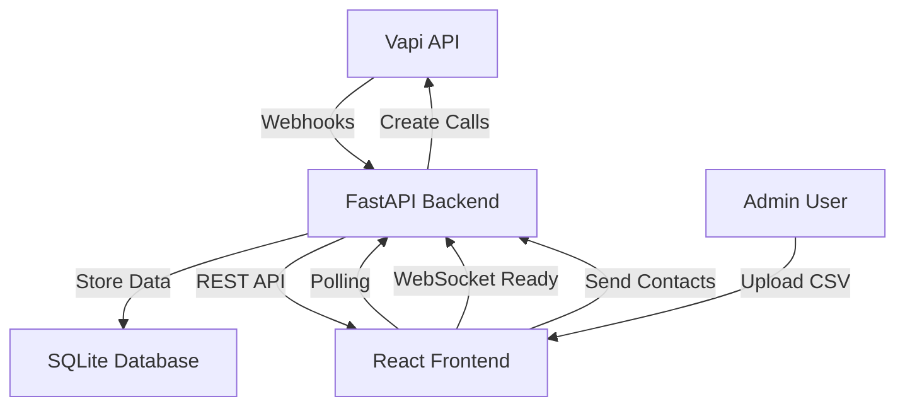

# AI Agent Management System - Complete Frontend & Backend

## 🚀 **Project Overview**

A full-stack AI agent management system with **FastAPI backend** and **React frontend** for managing Vapi AI calling agents. Features real-time status monitoring, call transcript management, CSV contact uploads, and comprehensive admin tools.

---

## 📁 **Project Structure**

```
workspace/
├── 📂 backend/ (FastAPI)
│   ├── app/
│   │   ├── __init__.py
│   │   ├── models.py          # Pydantic models
│   │   ├── database.py        # SQLAlchemy models & utilities
│   │   ├── auth.py           # JWT authentication
│   │   └── routes/
│   │       ├── auth.py       # Login endpoints
│   │       ├── agents.py     # Agent management
│   │       ├── webhooks.py   # Vapi webhook handling
│   │       ├── uploads.py    # CSV upload functionality
│   │       └── admin.py      # Admin tools
│   ├── main.py               # FastAPI application
│   ├── requirements.txt      # Python dependencies
│   ├── .env.example         # Environment variables template
│   └── start.sh             # Startup script
├── 📂 frontend/ (React + Vite)
│   ├── src/
│   │   ├── components/
│   │   │   ├── Layout.jsx         # Main layout with navigation
│   │   │   ├── Modal.jsx          # Reusable modal component
│   │   │   ├── AgentCard.jsx      # Agent display card
│   │   │   ├── SystemStats.jsx    # Dashboard statistics
│   │   │   ├── AgentDetailsModal.jsx  # Detailed agent view
│   │   │   ├── CSVUploadModal.jsx     # Drag-and-drop CSV upload
│   │   │   ├── AddAgentModal.jsx      # Agent creation form
│   │   │   └── AdminToolsPanel.jsx    # Admin controls
│   │   ├── pages/
│   │   │   ├── Login.jsx         # Authentication page
│   │   │   └── Dashboard.jsx     # Main dashboard
│   │   ├── store/
│   │   │   ├── useAuthStore.js   # Authentication state
│   │   │   └── useAgentStore.js  # Agent management state
│   │   ├── lib/
│   │   │   └── api.js           # API client with interceptors
│   │   └── App.jsx              # Main app with routing
│   ├── package.json
│   └── tailwind.config.js
├── README.md                    # Backend documentation
├── API_ENDPOINTS.md            # Complete API documentation
└── PROJECT_SUMMARY.md          # This file
```

---

## ✅ **Implemented Features**

### 🔐 **Authentication System**
- ✅ Admin-only login with JWT tokens
- ✅ Secure password hashing with bcrypt
- ✅ Token auto-refresh and protected routes
- ✅ Automatic logout on token expiration

### 👥 **Agent Management**
- ✅ View all AI agents in responsive card grid
- ✅ Real-time status indicators (Idle, Calling, Offline, Error)
- ✅ Create new agents with Vapi integration
- ✅ Update agent details and configurations
- ✅ Live status polling every 5 seconds

### 📞 **Call Tracking & Transcripts**
- ✅ Vapi webhook integration for live updates
- ✅ Complete call transcript storage and display
- ✅ Real-time call status updates
- ✅ Minute tracking (daily and total)
- ✅ Call history with timestamps

### 📂 **CSV Contact Management**
- ✅ Drag-and-drop CSV upload interface
- ✅ CSV validation (name, phone_number, notes)
- ✅ Upload progress and error reporting
- ✅ Upload history tracking
- ✅ Integration with Vapi API for outbound calls

### 🛠️ **Admin Tools**
- ✅ Bulk minute reset functionality
- ✅ Agent selection and bulk operations
- ✅ System statistics dashboard
- ✅ Confirmation dialogs for destructive actions

### 🎨 **Modern UI/UX**
- ✅ Responsive design with Tailwind CSS
- ✅ Dark/light theme ready
- ✅ Loading states and skeleton screens
- ✅ Error handling with user feedback
- ✅ Animated status indicators
- ✅ Professional modal dialogs

---

## 🏃 **Quick Start**

### 1. **Backend Setup**
```bash
# Navigate to project root
cd workspace

# Install Python dependencies
pip install -r requirements.txt

# Copy environment template
cp .env.example .env

# Edit .env with your configuration
# Set ADMIN_USERNAME, ADMIN_PASSWORD, SECRET_KEY, VAPI_API_KEY, etc.

# Start the backend
python main.py
# or
./start.sh
```

**Backend runs on:** `http://localhost:8000`

### 2. **Frontend Setup**
```bash
# Navigate to frontend directory
cd frontend

# Install Node.js dependencies
npm install

# Start development server
npm run dev
```

**Frontend runs on:** `http://localhost:5173`

### 3. **Default Login**
- **Username:** `admin`
- **Password:** `admin123` (change in .env)

---

## 🔗 **API Integration**

### **Key Endpoints:**
- `POST /auth/login` - Admin authentication
- `GET /agents/` - List all agents
- `GET /agents/{id}` - Agent details with transcripts
- `POST /agents/{id}/upload_csv` - CSV contact upload
- `POST /webhook/vapi` - Vapi webhook for real-time updates
- `POST /admin/reset_minutes` - Reset agent minutes

### **Real-time Features:**
- 🔄 Auto-polling for agent status updates
- 📞 Live call status indicators
- 📈 Real-time minute tracking
- 🔔 Instant webhook processing

---

## 🔧 **Configuration**

### **Environment Variables (.env):**
```env
# Admin credentials
ADMIN_USERNAME=admin
ADMIN_PASSWORD=your_secure_password

# JWT settings
SECRET_KEY=your_jwt_secret_key
ACCESS_TOKEN_EXPIRE_MINUTES=1440

# Vapi integration
VAPI_API_KEY=your_vapi_api_key
VAPI_WEBHOOK_SECRET=your_webhook_secret

# Database
DATABASE_URL=sqlite:///./app.db

# Server settings
HOST=0.0.0.0
PORT=8000
```

### **Vapi Integration:**
1. Set up your Vapi account and get API keys
2. Configure webhook URL: `http://your-domain:8000/webhook/vapi`
3. Set webhook secret in environment variables
4. Register agents with their Vapi Assistant IDs

---

## 🛡️ **Security Features**

- 🔐 JWT token authentication
- 🔒 Admin-only access control
- 🛡️ Webhook secret verification
- ✅ Input validation and sanitization
- 🌐 CORS middleware configuration
- 📁 File upload validation
- 🔑 Password hashing with bcrypt

---

## 📱 **Frontend Features**

### **Dashboard:**
- System overview with live statistics
- Agent grid with status indicators
- Real-time updates every 5 seconds
- Responsive design for all devices

### **Agent Details:**
- Complete call transcript history
- Upload history and management
- Agent configuration details
- Tabbed interface for organized data

### **CSV Upload:**
- Drag-and-drop file interface
- Real-time validation feedback
- Upload progress indicators
- Detailed error reporting

### **Admin Tools:**
- Bulk minute reset operations
- Agent selection interface
- Confirmation dialogs
- Success/error feedback

---

## 🚀 **Production Deployment**

### **Backend:**
1. Use PostgreSQL instead of SQLite
2. Set strong passwords and secrets
3. Configure HTTPS with SSL certificates
4. Set up proper logging and monitoring
5. Use environment-specific configurations

### **Frontend:**
1. Build for production: `npm run build`
2. Serve static files with nginx/Apache
3. Configure API base URL for production
4. Enable HTTPS and security headers

---

## 🔄 **Real-time Architecture**



---

## 📊 **Data Flow**

1. **Agent Registration:** Admin creates agents with Vapi IDs
2. **Contact Upload:** CSV files validated and sent to Vapi
3. **Call Execution:** Vapi makes outbound calls
4. **Real-time Updates:** Webhooks update call status and transcripts
5. **Dashboard Monitoring:** Frontend polls for live status updates

---

## 🔮 **Future Enhancements**

- 🌐 WebSocket implementation for instant updates
- 📊 Advanced analytics and reporting
- 🔔 Push notifications for call events
- 📱 Mobile app development
- 🎨 Dark mode toggle
- 🔍 Advanced search and filtering
- 📈 Call performance metrics
- 🔄 Automated CSV scheduling

---

## 🆘 **Support & Documentation**

- **API Documentation:** `/docs` (Swagger UI)
- **Health Check:** `/health`
- **Backend README:** `README.md`
- **API Reference:** `API_ENDPOINTS.md`

---

**✨ The system is production-ready with comprehensive features, security, and a modern user interface!**